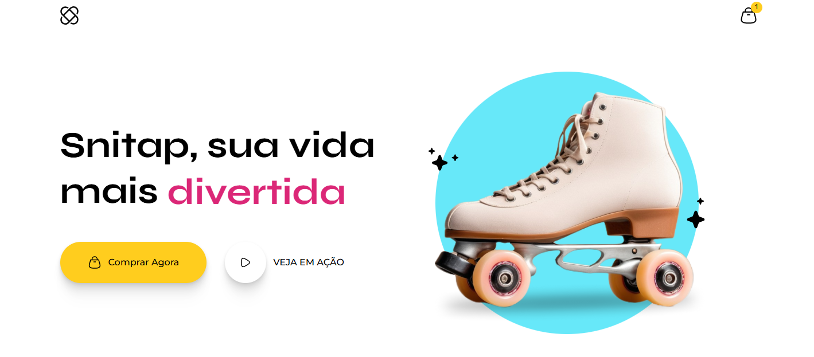

# Snitap Patins - Landing Page Responsiva

## 🌟 Sobre o Projeto

Este projeto é uma landing page vibrante e responsiva para "Snitap Patins", desenvolvida por **Kevin Lopes** como um desafio prático e de aprendizado. O foco principal deste projeto foi a exploração e aplicação de técnicas avançadas de front-end para criar uma experiência de usuário dinâmica e adaptável a diferentes dispositivos.

### Objetivos de Aprendizagem:

- **Transições e Animações CSS:** Aprofundar o conhecimento em `keyframes` e `transition` para criar efeitos visuais fluidos e envolventes, como o `slideUp` do texto principal e o `slideIn` das imagens na seção Hero, além de outros efeitos de hover.
- **Design Responsivo (Mobile-first):** Implementar um layout flexível que se adapta perfeitamente a diversas resoluções de tela, com ênfase na experiência em dispositivos móveis, utilizando `media queries` e unidades relativas (`rem`, `vw`).
- **Estrutura e Modularização CSS:** Organizar os estilos em arquivos separados (`global.css`, `header.css`, `hero.css`, etc.) e um arquivo `mobile.css` para estilos específicos de dispositivos móveis, promovendo a manutenibilidade do código.

## ✨ Funcionalidades

- **Layout Adaptável:** Experiência de navegação otimizada para desktops, tablets e smartphones.
- **Animações Cativantes:** Elementos dinâmicos que adicionam vida e interatividade à página.
- **Transições Suaves:** Efeitos visuais que tornam a interação do usuário mais agradável.
- **Estrutura de Conteúdo Clara:** Seções bem definidas como cabeçalho, hero, banner, galeria de fotos e rodapé.

## 🚀 Tecnologias Utilizadas

- **HTML5:** Estrutura semântica do conteúdo.
- **CSS3:** Estilização completa, incluindo:
  - `Flexbox` e `CSS Grid` para layouts complexos.
  - `@media queries` para responsividade.
  - `@keyframes` para animações personalizadas.
  - Unidades `rem` e `vw` para escalabilidade de fontes e elementos.
  - Propriedades `position` para posicionamento preciso de elementos sobrepostos.

## ⚙️ Como Executar o Projeto

É muito simples! Para visualizar a landing page em seu navegador:

1.  Faça o download ou clone este repositório para o seu computador.
2.  Navegue até a pasta raiz do projeto.
3.  Abra o arquivo `index.html` diretamente em seu navegador web preferido.

## 👤 Desenvolvedor

Este projeto foi desenvolvido por Kevin Lopes.

- **LinkedIn:** [https://www.linkedin.com/in/kevin-lopes-151797221/](https://www.linkedin.com/in/kevin-lopes-151797221/)
- **GitHub:** [https://github.com/KevinLopes23](https://github.com/KevinLopes23)

---

Agradeço por visitar este projeto! Espero que ele inspire e demonstre o potencial do desenvolvimento front-end com foco em responsividade e animações. 👋
